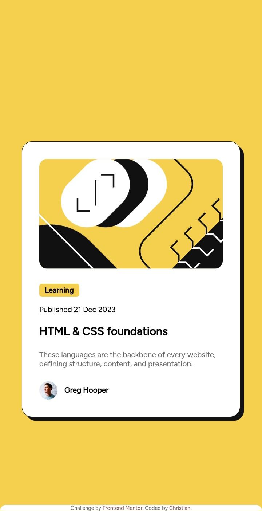

# Frontend Mentor - Blog preview card solution

This is a solution to the [Blog preview card challenge on Frontend Mentor](https://www.frontendmentor.io/challenges/blog-preview-card-ckPaj01IcS). Frontend Mentor challenges help you improve your coding skills by building realistic projects. 

## Table of contents

- [Overview](#overview)
  - [The challenge](#the-challenge)
  - [Screenshot](#screenshot)
  - [Links](#links)
- [My progress](#my-progress)
  - [Built with](#built-with)
  - [What I learned](#what-i-learned)
  - [Useful resources](#useful-resources)
- [Author](#author)

### Overview 

This is an interesting challenge. It helped me to learn about responsive fonts, and I learned a new syntax.

### The challenge

Users should be able to:

- See hover and focus states for all interactive elements on the page

### Screenshot



### Links

- [Solution](https://github.com/Christian-Emmanuel5/Frontendm-challenges/tree/main/blog-preview)
- [Live site](https://frontendm-challenge2-4dhwd4y0f-owiochos-projects.vercel.app/)

## My process

Getting better in positioning elements and Responsive designs.

### Built with

- Semantic HTML5 markup
- CSS custom properties
- Flexbox
- CSS Grid
- Mobile-first workflow

### What I learned

The Css clamp() function. It's a game changer for responsive designs.
```css
.element {
  width: clamp(<min-value>, <desired-value>, <max-value>);
}
```

### Useful resources

- [You Really Know Responsive Font Sizes](https://medium.com/design-bootcamp/you-really-know-responsive-font-sizes-f356bb3b461d) - Explains different methods of making fluid font flow across different devices.
- [MDN_ @font-face](https://developer.mozilla.org/en-US/docs/Web/CSS/@font-face) - This points to the @font-face css property and subtopics under it.

## Author

- Frontend Mentor - [@owiechris](https://www.frontendmentor.io/profile/owiechris)