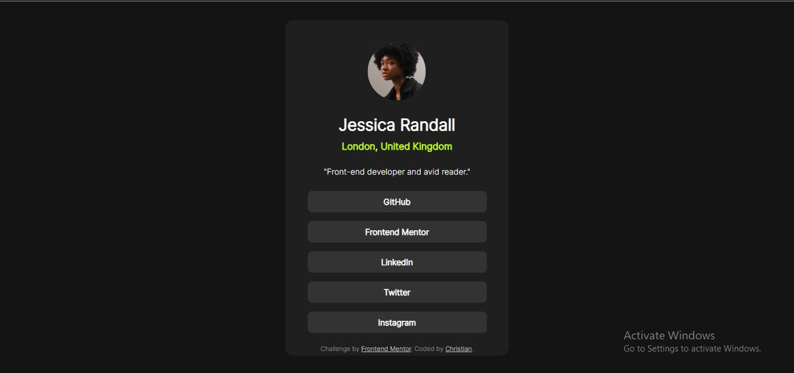

# Frontend Mentor - Social links profile solution

This is a solution to the [Social links profile challenge on Frontend Mentor](https://www.frontendmentor.io/challenges/social-links-profile-UG32l9m6dQ). Frontend Mentor challenges help you improve your coding skills by building realistic projects. 

## Table of contents

  - [The challenge](#the-challenge)
  - [Screenshot](#screenshot)
  - [Links](#links)
- [My process](#my-process)
  - [Built with](#built-with)
  - [What I learned](#what-i-learned)
- [Acknowledgments](#acknowledgments)

### The challenge

Users should be able to:

- See hover and focus states for all interactive elements on the page

### Screenshot

### Links

- [Solution](https://github.com/Christian-Emmanuel5/Frontendm-challenges/tree/2ae79ea0fab762556ecdb4ecc8105041bf3ea2f9/social-links-profile-main)
- [Live site](https://frontendm-challenges3.vercel.app/)

## My process

### Built with

- Semantic HTML5 markup
- CSS custom properties
- Flexbox
- CSS Grid
- Mobile-first workflow

### What I learned

Realised I did'nt need to explicitly write rules for the height of the design.

## Acknowledgments

I solved it myselve but I was more careful and conscious of my class names and the precidures for solving the problem.

Thank you to the frontend folks. I'm learning from you...